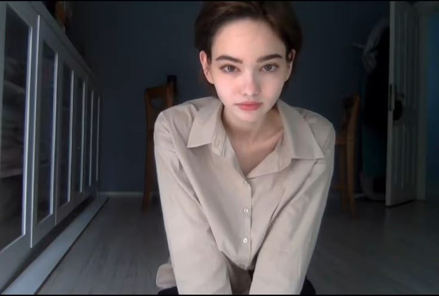
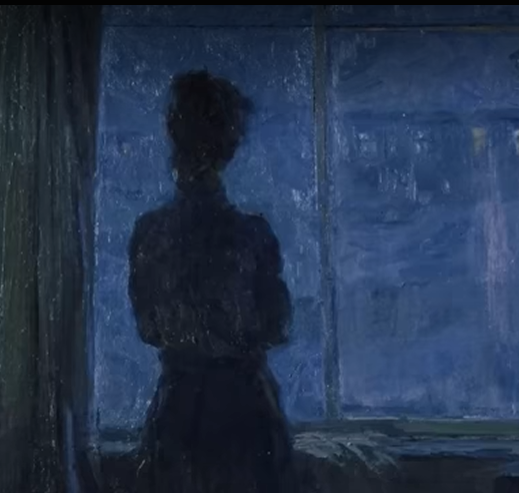
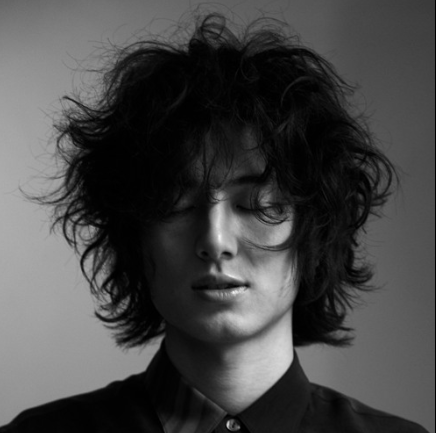
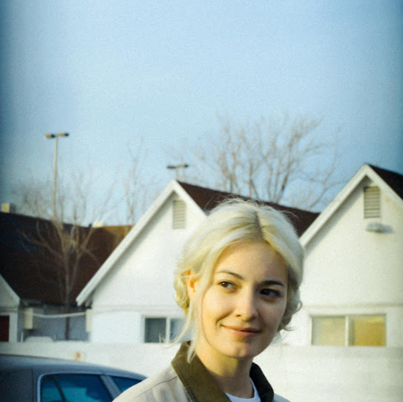
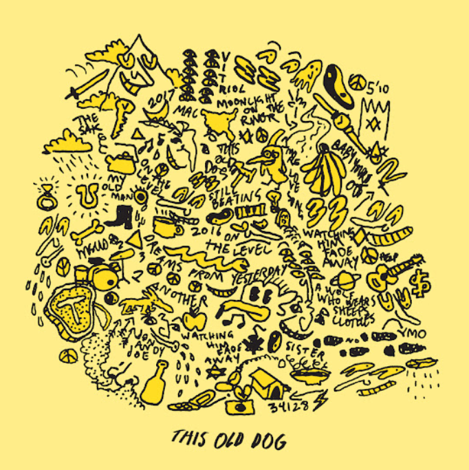

# Monya

**Monya** is a minimalist single-page website dedicated to *stopitMonya*, a Turkish TikTok creator known for her cinematic vlog-style videos.  
The page features sections for voting, gallery, music highlights, and a personal profile — built with **Tailwind CSS** and **Swiper.js**.

---

## 📸 Preview

### Homepage  

### Gallery  
|  |  |  |  
|-----------------------------------|-----------------------------------|-----------------------------------|
|  |  |                                   |

### Profile  

---

## 🎵 Music Section

|  |  |  |
|--------------------------------------|--------------------------------------|--------------------------------------|
|  |  |                                      |

Monya’s featured songs include **Vangelis**, **Malice Mizer**, **Mac DeMarco**, **Man I Trust**, and **Fujii Kaze** — echoing her calm and nostalgic aesthetics.

---

## 🌐 Sections

- **Hero** — a fullscreen intro featuring Monya.  
- **Vote** — simple interactive polling component.  
- **Gallery** — image grid with soft transitions.  
- **Music** — Swiper.js carousel of TikTok soundtracks.  
- **Profile** — biographical details and ranking cards.  
- **Connect** — links to her TikTok and Instagram.

---

## 🛠️ Tech Stack

- **Tailwind CSS** — layout & typography  
- **Swiper.js** — carousel for music section  
- **PhotoSwipe** — prepared for lightbox gallery  
- **Google Fonts: Inter** — typography  
- **HTML5 / CSS3 / JS (Vanilla)** — no frameworks needed  

---

## 📂 Folder Structure

Monya/
├── [id]
├── index.html
├── pic/
│ ├── logo/
│ │ ├── favicon.png
│ │ └── logo3.png
│ ├── foto/
│ │ ├── foto1.jpeg
│ │ ├── foto2.jpeg
│ │ ├── foto3.jpeg
│ │ ├── foto4.jpeg
│ │ └── foto5.jpeg
│ ├── music_pic/
│ │ ├── music1.png
│ │ ├── music2.png
│ │ ├── music3.png
│ │ ├── music4.png
│ │ └── music5.png
│ └── profil_pic.png
└── arsip.html

---

## 📜 License

This project is for educational and portfolio purposes only.  
All rights to Monya’s images and likeness belong to their original creator.
